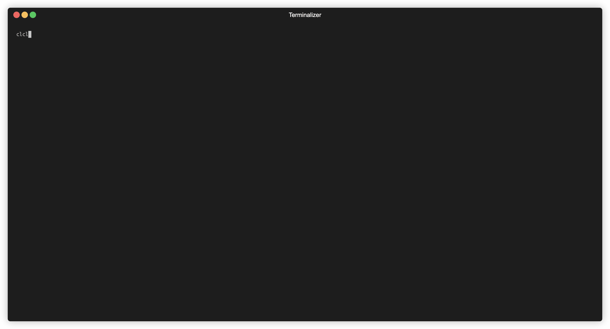

# ghostie

> Github notifications in your terminal. Available on MacOS and Linux.



## Features

- Runs as background process, fetching new github notifications in a 48h rolling
    window.
- Polls every 1 minute and uses SQLite to persist local cache of notifications.
- Issues desktop notification (MacOS only for now) when new notifications
    are received.
- View notifications in your terminal and opens them in your default browser when
    selected.

## Installation

### Homebrew (OS X or Linux)

1. Install the tap

```sh
brew tap attriaayush/ghostie
```

1. Install `ghostie`

```sh
brew install ghostie
```

### Uninstalling with Homebrew

1. Uninstall `ghostie`

```sh
brew uninstall ghostie
```

1. Uninstall the tap

```sh
brew untap attriaayush/ghostie
```

### Install manually from Release

1. [Download the latest release for your platform](https://github.com/attriaayush/ghostie/releases)
1. Install to a location in your $PATH

### Install manually from source

1. [Ensure Rust is installed](https://www.rust-lang.org/tools/install)
1. Clone this repo and run `cd ghostie`
1. Run `cargo install --path .`
1. Ensure `~/.cargo/bin` is in your `$PATH`

## Usage

Simply run `ghostie` and see the list of things that Ghostie supports.

**Note: To view the notifications using `ghostie view` ensure `ghostie` is running
as a background process.**

```
ghostie
manage your github notifications in terminal

USAGE:
    ghostie <SUBCOMMAND>

SUBCOMMANDS:
    clear-logs    Clear logs from the background process
    count -C      Query the count of unread github notifications
    logs -L       Show logs from the background process
    prune -P      Prune all notifications from the local cache
    start         Run ghostie as a background process
    stop          Stop ghostie as a background process
    view -V       Open UI to manage github notifications
```

